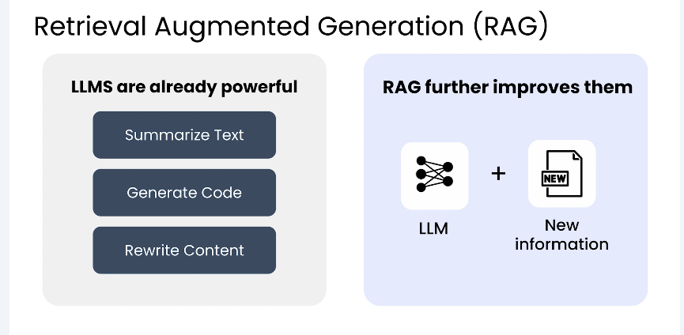
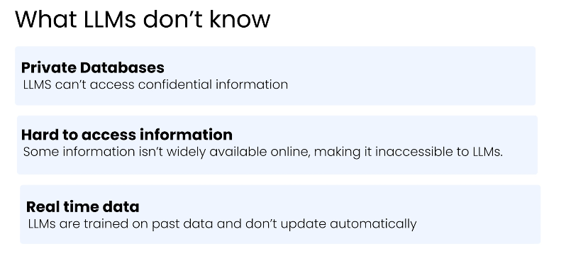
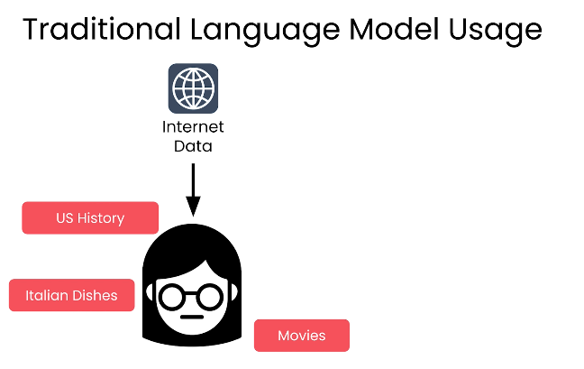
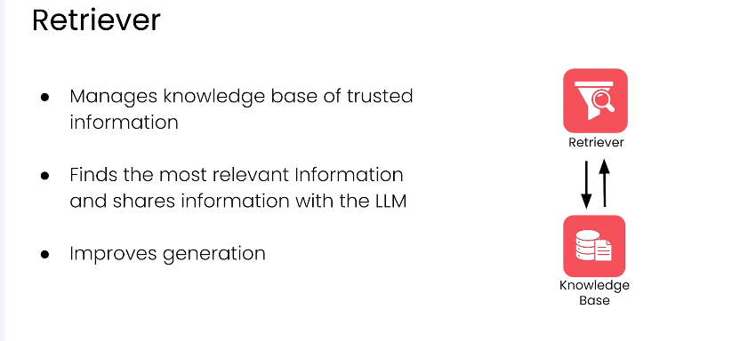

# RAG Foundations (Retrieval-Augmented Generation) 🚀

Large Language Models (LLMs) are powerful systems capable of summarizing text,  
writing code, and generating high-quality natural language responses.  
However, they have a fundamental limitation: **they do not fetch new information at runtime**.

This section explains **why RAG exists**, **what problem it solves**, and  
**how it works**, using a simple and highly relatable example. 📚

---
## What LLMs Do Well — and Where They Fail ✅

LLMs generate responses based on patterns learned during training.  
This works well when:

- The question depends on general knowledge
- The answer does not change frequently
- No private or recent data is required

**Example:**

> Why do people usually feel sleepy after lunch?
The model can reason and respond directly.

**Flow:**  
Reason → Respond

yaml
Copy code

No external information is needed.

---

## When Reasoning Alone Is Not Enough ❌

Now consider this question:

> What documents do I need to apply for a visa to Germany from Pakistan **this year**?

This question:
- Depends on **current rules**
- May vary by country and year
- Cannot be answered reliably from memory

If an LLM guesses, the answer may be:
- Outdated
- Incomplete
- Incorrect

What is missing here is **relevant information**, not reasoning ability.

**Correct flow:**  
Collect Information → Reason → Respond

yaml
Copy code

---

## The Core Limitation of Traditional LLMs ⚠️

Traditional LLMs:
- Do not know recent updates
- Cannot access private or organizational data
- Cannot be experts in every specialized domain

Retraining a model for every update is:
- Expensive
- Slow
- Impractical

So the real question becomes:

**How do we give the LLM the right information at the time of the question?** 🤔

---

## What Is Retrieval-Augmented Generation (RAG)? 🔍

RAG solves this by separating the task into **two clear steps**:

### 1. Retrieval
The system searches a knowledge source (documents, PDFs, databases, internal data)  
and finds the **most relevant information**.

### 2. Generation
The retrieved information is added to the prompt.  
The LLM then reasons over this information to generate a grounded response.

This is why it is called:

Retrieval → Augmentation → Generation

yaml
Copy code

The model is not guessing — it is **reasoning over provided evidence**.

---

## A Simple, Relatable Example 🎓

Imagine asking:

> What topics will be covered in my university’s AI exam next week?

### Without RAG
The LLM can only guess based on general AI curricula.  
The answer may sound confident but be wrong.

### With RAG
1. The system retrieves:
   - Your course outline
   - Lecture slides
   - Exam announcements
2. This information is added to the prompt
3. The LLM generates an answer based on **your actual materials**

Now the response is:
- ✅ Relevant
- ✅ Accurate
- ✅ Context-aware

---

## Why RAG Matters in Real Systems 🌐

RAG is essential when:
- Information changes frequently
- Data is private or enterprise-specific
- Accuracy and grounding matter

This is why RAG is used in:
- Enterprise AI assistants
- Customer support systems
- Legal and healthcare tools
- Research and documentation search
- Agentic AI systems

---

## Key Takeaway 📝

RAG does **not** make the LLM smarter.  

It makes the LLM:
- Better informed
- More reliable
- Grounded in real data

Instead of expecting the model to *know everything*,  
we let it **retrieve first, then reason**. ✅
