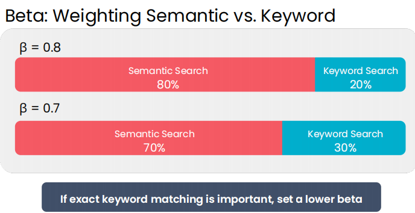
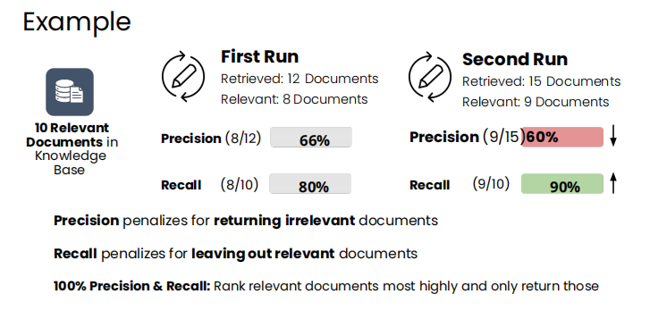

# 🔎 Retriever Architecture

*In a Retrieval-Augmented Generation (RAG) system, the **retriever** is responsible for finding the most relevant documents for a given user prompt.*

When a prompt is received, it is first sent to the retriever, which searches a **knowledge base** (a collection of documents 📚) and returns the best matches to be passed to the **LLM** 🤖.

---

## 📑 Content Index

* [Keyword Search](#-keyword-search)
* [Semantic Search](#-semantic-search)
* [Metadata Filtering](#-metadata-filtering)
* [Hybrid Search](#-hybrid-search)

---

## 🔑 Keyword Search

**Keyword search** retrieves documents containing the **exact words** from the user’s prompt.
It is the **classic retrieval technique**, used in search engines and databases for decades.

**Characteristics**

* Precise and fast ⚡
* Sensitive to exact wording
* Weak at understanding meaning

---

### 📌 How Keyword Search Works

1. **Bag of Words (BoW)**

   * Text is converted into vectors of word counts
   * Word order is ignored
   * Results in sparse vectors

2. **Inverted Index**

   * Maps each word to the documents that contain it
   * Enables fast keyword lookups

3. **Document Scoring**

   * Counts keyword matches
   * Normalizes for document length
   * Weights important words using **TF-IDF**

---

### 📑 TF-IDF (Term Frequency–Inverse Document Frequency)

* Rare words → higher weight
* Common words → lower weight
* Highlights discriminative terms

---

### 🧩 Example

Prompt:
`"making pizza without a pizza oven"`

* Keywords: `pizza`, `making`, `oven`
* Documents containing rare terms like **pizza** score higher
* Common words like *“a”* contribute little

---

### 🏆 BM25 (Best Matching 25)

BM25 is the **industry-standard keyword ranking algorithm** used in modern retrievers.

**Why BM25 improves on TF-IDF**

* **Term frequency saturation**
  Repeating a word many times yields diminishing returns
  (“pizza” ×20 ≠ twice as relevant as “pizza” ×10)

* **Smarter length normalization**
  Long documents are penalized gently, not aggressively

* **Tunable behavior**

  * `k₁` → controls term frequency saturation
  * `b` → controls length normalization

---

### ✅ Strengths

* Fast and interpretable
* Ensures keyword presence
* Ideal for exact or technical queries

### ⚠️ Limitations

* Cannot understand synonyms or intent
* Misses semantic relevance
* Needs semantic search for completeness

---

# 🧩 Semantic Search

**Semantic search retrieves documents based on meaning, not exact words.**

Instead of asking:

> *“Which documents contain these words?”*

It asks:

> *“Which documents express the same idea?”*

This makes it essential for natural language queries in RAG systems.

---

### ❌ Why Keyword Search Is Not Enough

Keyword search fails when:

* Different words share the same meaning
  *happy ≠ glad*
* One word has multiple meanings
  *Python (language) ≠ python (snake)*

Semantic search resolves this by modeling **context and intent**.

---

### 🧠 Core Idea: Everything Becomes a Vector

Semantic search converts text into vectors using an **embedding model**:

1. Documents → vectors
2. Prompt → vector
3. Similar meaning → similar vectors

---

### 📍 What Is an Embedding?

An **embedding** is a numerical representation of meaning.

* Similar concepts → vectors close together
* Unrelated concepts → vectors far apart

Think of it as a **map of meaning** in high-dimensional space:

* *food* ↔ *cuisine* → close
* *trombone* ↔ *cat* → far

---

### 📐 Measuring Similarity

The retriever compares vectors using **cosine similarity**:

* Measures **direction**, not magnitude
* Focuses on semantic orientation
* Stable in high-dimensional spaces

Higher cosine similarity → higher relevance

---

### 🧩 Example

Prompt:
`"He whispered quietly during class"`

* Document A: *“He spoke softly in class”* → high similarity
* Document B: *“Her daughter brightened the gloomy day”* → low similarity

---

### 🔍 Semantic Search in a RAG Pipeline

1. Embed all documents
2. Embed the user prompt
3. Compute similarity scores
4. Rank documents
5. Send top results to the LLM

---

### ✅ Strengths

* Understands synonyms and paraphrases
* Matches intent, not wording
* Essential for conversational queries

### ⚠️ Limitations

* Does not guarantee keyword presence
* May surface semantically close but factually weak results
* Best combined with keyword search

---
## ⚙️ How Embeddings Are Trained
**1. Collect Examples**
- Positive pairs: text with similar meaning
- Negative pairs: text with different meaning

Millions of pairs are used to capture subtle relationships across concepts.

**2. Initialize Vectors**

- Start randomly: vectors have no meaning at the beginning
- Untrained vectors → retrieval would be meaningless

**3. Contrastive Learning**

_For each pair:_

1. Pull positive pairs closer
2. Push negative pairs farther apart
3. Repeat iteratively over all examples

The model updates its internal parameters at each step

**4. High-Dimensional Space**

- Embeddings often have hundreds or thousands of dimensions
- High dimensions give flexibility to place millions of texts meaningfully
- Each text is influenced by many positives and negatives at once

---
# 🏷️ Metadata Filtering

**Metadata filtering** narrows documents using **structured attributes**, not text content.

---

### 📌 What Is Metadata?

Metadata includes:

* Author
* Date
* Section
* Access level
* Region or department

It acts as **strict pre-conditions** before ranking.

---

### ⚙️ How It Works

1. Each document has metadata fields
2. Filters exclude documents that fail conditions
3. Remaining documents are passed to search

> Comparable to SQL `WHERE` clauses or spreadsheet filters

---

### 🧩 Example

Newspaper retriever:

* User is a free subscriber
* Region: Europe

Query:

> “Opinion articles by Alice in June 2024”

System:

* Excludes paid articles
* Filters to Europe region
* Ignores full text at this stage

---

### ✅ Advantages

* Fast and deterministic
* Enforces access control
* Easy to debug

### ⚠️ Limitations

* Does not rank relevance
* Ignores document meaning
* Cannot work alone

---

Below is a **concise, production-aligned, README-ready Hybrid Search section** that fits your existing structure and tone.
It avoids lecture-style explanation and instead communicates **system design thinking**, which is exactly what reviewers look for.

You can paste this **directly** under `## 🔀 Hybrid Search` in your `README.md`.

---

## 🔀 Hybrid Search

**Hybrid search combines keyword search, semantic search, and metadata filtering to leverage the strengths of each technique while minimizing their weaknesses.**
This is the standard approach used in production-grade retrievers for RAG systems.

---

### 🧠 Why Hybrid Search?

Each retrieval method solves a different problem:

* **Keyword search** → ensures exact term matching (critical for technical terms, IDs, product names)
* **Semantic search** → captures meaning and intent beyond exact words
* **Metadata filtering** → enforces strict rules (access control, region, date, permissions)

On their own, none of these techniques is sufficient.
Together, they form a robust and controllable retrieval pipeline.

---

### ⚙️ Hybrid Search Pipeline

1. **Receive user prompt**
2. **Run keyword search** (e.g., BM25) → ranked list A
3. **Run semantic search** (vector similarity) → ranked list B
4. **Apply metadata filters** to remove invalid documents
5. **Merge rankings** using *Reciprocal Rank Fusion (RRF)*
6. **Return top-K documents** to the LLM

This ensures documents are:

* relevant by **keywords**
* relevant by **meaning**
* valid by **rules**

---

### 🔄 Ranking Fusion (Reciprocal Rank Fusion)

Hybrid search merges keyword and semantic rankings using **Reciprocal Rank Fusion (RRF)**.

**Key properties:**

* Rewards documents ranked highly in *either* list
* Uses rank position, not raw scores
* Stable across different scoring scales

A document ranked:

* **2nd** in keyword search
* **10th** in semantic search

Still ranks well overall because it performs strongly in at least one signal.

---

### 🎛️ Tuning the Retriever

Hybrid retrievers expose tunable parameters:

* **Keyword vs Semantic weight (`β`)**

  * Example: `70% semantic / 30% keyword` (good default)
  * Increase keyword weight when exact matches matter
 

Below is a **clean, GitHub-ready Evaluation section** with a clear heading, relevant emojis, concise explanations, and a short **README wrap-up summary** at the end.
You can paste this directly into your `README.md`.

---

## 📊 Evaluation — Measuring Retriever Quality

### ❓ Why Do We Evaluate a Retriever?

A retriever is the **foundation of a RAG system**.
If it fails to find the right documents, even a powerful LLM cannot recover.

Evaluation helps us:

* Verify that relevant documents are actually retrieved
* Compare different retrieval strategies (keyword vs semantic vs hybrid)
* Tune parameters (BM25, embeddings, hybrid weights)
* Monitor quality during development and production

In short: **better retrieval → better answers**.

---

## 🔍 What Is Needed to Evaluate a Retriever

All retriever quality metrics rely on three components:

1. **Prompt**
   Retrievers may perform well on some queries and poorly on others.

2. **Ranked Results**
   The ordered list of documents returned by the retriever.

3. **Ground Truth**
   The complete set of documents that are truly relevant to the prompt.

> Without ground truth, retrieval quality cannot be measured reliably.

---

## 🎯 Precision & Recall (Core Metrics)

### **Precision**

Measures **result quality**.

> Of all retrieved documents, how many are actually relevant?

[
\text{Precision} = \frac{\text{Relevant Retrieved}}{\text{Total Retrieved}}
]

* High precision → fewer irrelevant documents
* Indicates how **trustworthy** the results are

---

### **Recall**

Measures **coverage**.

> Of all relevant documents that exist, how many were retrieved?

[
\text{Recall} = \frac{\text{Relevant Retrieved}}{\text{Total Relevant}}
]

* High recall → fewer missed documents
* Indicates how **complete** the retrieval is

---

## ⚖️ Precision–Recall Tradeoff

Precision and recall usually move in opposite directions:

* Returning **more documents** → higher recall, lower precision
* Returning **fewer documents** → higher precision, lower recall

In **RAG systems**, recall is often prioritized because:

> Missing important context is more harmful than including extra noise.

---

## 📌 Precision@K and Recall@K

To standardize evaluation, metrics are computed over the **top K ranked documents**:

* **Precision@K** — relevance of the top K results
* **Recall@K** — coverage of relevant documents within the top K

Typical values:

* **K = 5–15** for practical RAG systems
* Smaller K when stricter quality is required

---

## 🧩 Summary:

*This repository provides a production-oriented overview of retrievers in RAG systems, detailing keyword search, semantic embeddings, metadata filtering, and hybrid search pipelines.*

*It emphasizes building robust, tunable retrieval systems that maximize relevance, coverage, and reliability, ensuring high-quality context is delivered to downstream LLMs.*
 but by how **well it can be measured, tuned, and trusted**.

---
