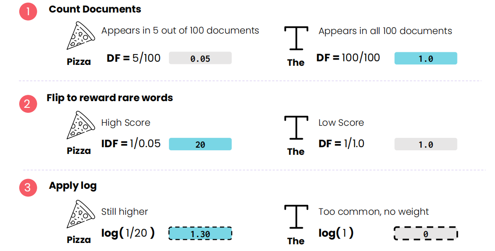
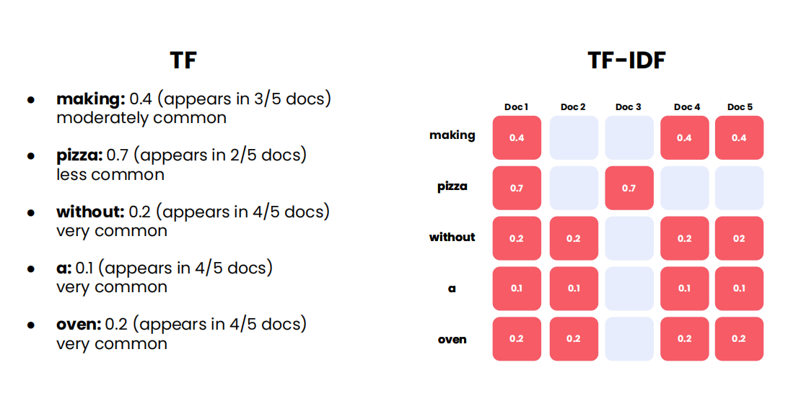
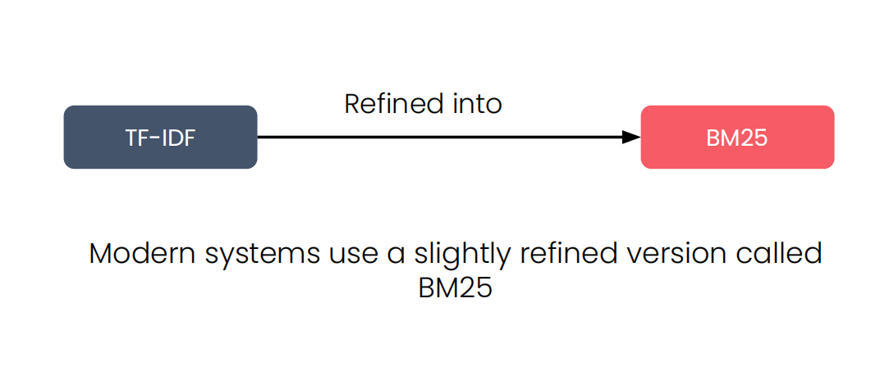
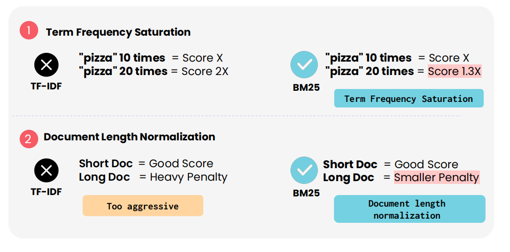
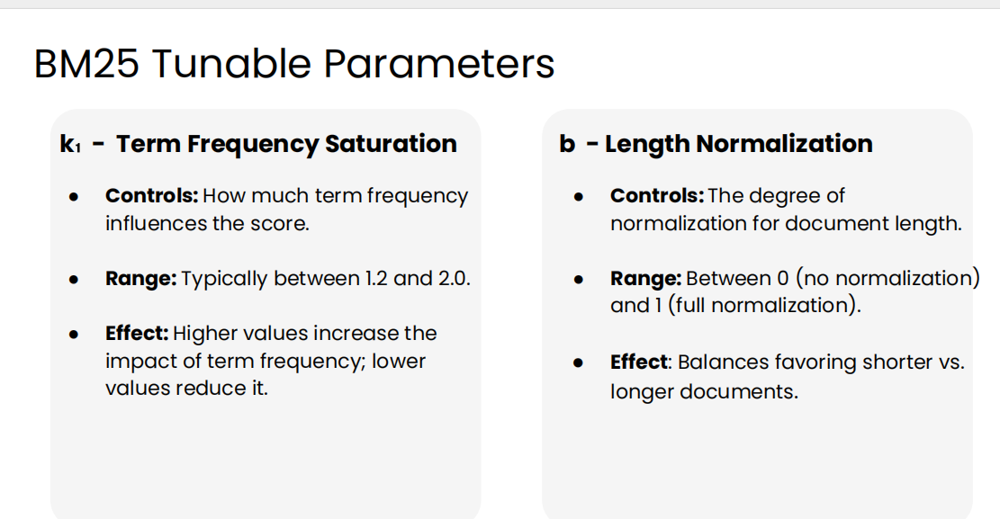
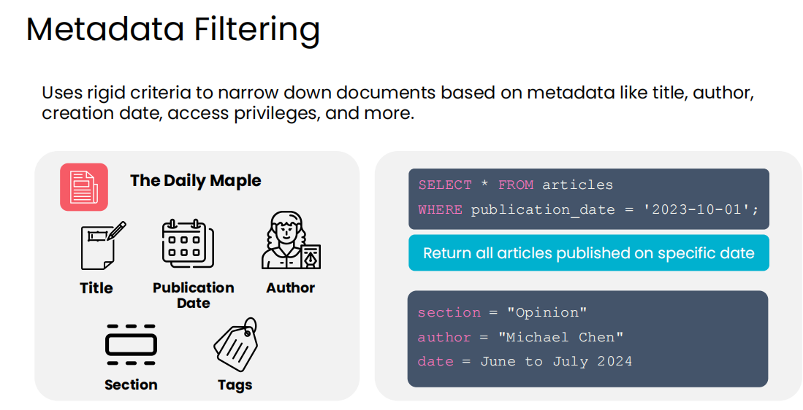

# 🔎 Retriever Architecture

*In a Retrieval-Augmented Generation (RAG) system, the **retriever** is responsible for finding the most relevant documents for a given user prompt.*

When a prompt is received, it is first sent to the retriever, which searches a **knowledge base** (a collection of documents 📚) and returns the best matches to be passed to the **LLM** 🤖.

---

## 📑 Content Index

* [Keyword Search](#-keyword-search)
* [Semantic Search](#-semantic-search)
* [Metadata Filtering](#-metadata-filtering)
* [Hybrid Search](#-hybrid-search)

---

## 🔑 Keyword Search

## 📑 Content Index

* [Keyword Search](#-keyword-search)
* [Semantic Search](#-semantic-search)
* [Metadata Filtering](#-metadata-filtering)
* [Hybrid Search](#-hybrid-search)

---

**Keyword search** retrieves documents containing the **exact words** from the user’s prompt. It is the **classic retrieval technique**, powering search engines and databases for decades.

* Precise and fast ⚡
* Sensitive to exact wording
* Limited when documents use different phrasing

### 📌 How It Works

1. **Bag of Words (BoW):**

   * Convert prompt and documents into vectors counting word occurrences
   * Order of words is ignored; only **frequency matters**
   * Sparse vectors are used since most words are absent in each document

2. **Term-Document Matrix / Inverted Index:**

   * Rows → words, Columns → documents
   * Allows fast lookup: find all documents containing a specific word

3. **Scoring Documents:**

   * Count keyword matches
   * Normalize for document length to avoid bias toward longer documents
   * Weight keywords using **TF-IDF** for importance

---

### 📑 TF-IDF (Term Frequency–Inverse Document Frequency)

* Rare words → higher weight
* Common words → lower weight
* Helps identify **more relevant documents**
  

---

### 🧩 Example

Prompt: `"making pizza without a pizza oven"`

* Keyword counts → `pizza: 2, making: 1, oven: 1, ...`
* Documents with rare keywords like `"pizza"` score higher than those with common words like `"a"`
  

---
### 🏆 BM25 (Best Matching 25)

BM25 is the **modern standard** keyword search algorithm:

* **Term frequency saturation:** repeated keywords give diminishing returns
* **Document length normalization:** long documents are penalized mildly
* **Tunable hyperparameters:** control keyword repetition and length penalties

> BM25 is widely used in production retrievers (Elasticsearch, OpenSearch, etc.)

**Key improvements over TF-IDF:**

* **Term frequency saturation**
  Repeated keywords give diminishing returns.
  A document mentioning *“pizza”* 20 times is **not** twice as relevant as one mentioning it 10 times.

* **Smarter length normalization**
  Long documents are penalized gently, not harshly, allowing relevant long content to rank well.

* **Tunable behavior**
  Two parameters control scoring:

  * **k₁** → how quickly term frequency saturates
  * **b** → how strongly document length is normalized

### ✅ Strengths

* Simple, fast, and interpretable
* Ensures documents contain **prompt keywords**
* Works well in technical or exact-term queries

### ⚠️ Limitations

* Relies on exact word matches → misses semantic equivalents
* Cannot rank documents by true relevance alone
* Needs **semantic search** or **metadata filters** for full coverage

---

## 🏷️ Metadata Filtering

*Metadata filtering* narrows down documents based on **structured attributes**, not content. It works alongside keyword or semantic search to refine results.

### Concept Index

* [What is Metadata Filtering](#what-is-metadata-filtering)
* [How It Works](#how-it-works)
* [Example](#example)
* [Use in RAG](#use-in-rag)
* [Advantages](#advantages)
* [Limitations](#limitations)

### What is Metadata Filtering

Metadata filtering selects documents using **metadata** rather than full text. Common metadata includes:

* Title
* Author
* Creation date
* Access level (e.g., free or paid)
* Region or department

Think of it as **strict rules that filter a large dataset** before further retrieval.

### How It Works

1. Each document in the knowledge base has metadata attached.
2. Filters exclude documents that do not meet criteria.
3. Only documents satisfying **all conditions** are returned.

> Conceptually, it’s like filtering rows in a spreadsheet or a SQL query.

Filters can be dynamic depending on the user:

* Paid vs free subscriber
* User location / region
* Department-specific access

### Example

Suppose you build a retriever for a newspaper:

* Knowledge base: thousands of articles
* Metadata per article: author, date, section, paid/free, region

**Queries:**

* “All opinion articles by Alice between June and July 2024”
* System detects the user is a free subscriber → excludes paid articles
* System detects the reader is in Europe → returns only Europe articles

> Only metadata is used in this step — the full text is ignored.

### Use in RAG Systems

* Metadata filtering **does not retrieve documents alone**.
* It refines results from **keyword or semantic search**.
* Filters are based on **user attributes**, not query text.

### Advantages ✅

* Conceptually simple — easy to understand and debug
* Fast and well-optimized
* Only method to strictly enforce inclusion/exclusion rules

### Limitations ⚠️

* Not a true search technique — does **not rank by relevance**
* Overly rigid — ignores document content
* Cannot determine if a document is truly relevant

> Metadata filtering is effective **only when combined with other retrieval techniques** like keyword or semantic search.

---

## 🔀 Hybrid Search

In practice, retrievers combine these techniques:

1. Run keyword search 🔑
2. Run semantic search 🧩
3. Apply metadata filters 🏷️
4. Merge and re-rank results 📊
5. Return the top relevant documents 🎯

This approach is called **hybrid search**.
